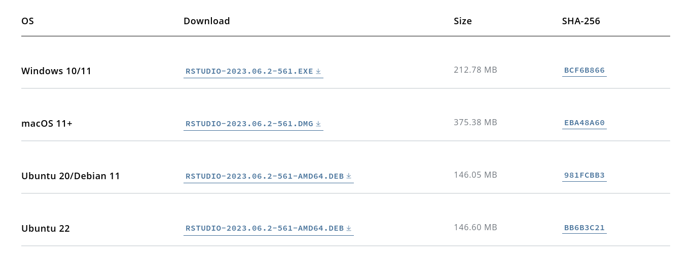

First, update your package repos and install any updates:

```bash
sudo apt update
sudo apt upgrade
```

Next, install at least `r-base` and perhaps `r-base-dev` from the Debian repository.

```bash
sudo apt install r-base r-base-dev
```

Now, we need to get the RStudio `.deb` file from the [posit](https://post.co/) website. Navigate to the [RStudio Desktop downloads page](https://posit.co/download/rstudio-desktop/).



Here, you can see they have a release for Ubuntu 20/Debian 11 and another one for Ubuntu 22. As of this writing, there doesn't appear to be an official release for Debian 12. The Ubuntu 20/Debian 11 binary depends on `libssl1.1`, which is no longer included in Debian 12 bookworm; it was last released with Debian 11 bullseye. Luckily, the Ubuntu 22 binary depends on `libssl-dev` instead, which _is_ released with Debian 12. **So, we will download the Ubuntu 22 binary.**

Now, `cd` into your `Downloads/` folder or wherever you saved the file.

```bash
cd Downloads
```

Assuming this is a fresh Debian install, if we were to `dpkg -i` the `.deb` right now, it would likely tell us it lacks the dependencies `libssl-dev` and `libclang-dev`. So, let's go ahead and install those first.

```bash
sudo apt install libssl-dev libclang-dev
```

Now, you can enter `dpkg -i rstudio` and then tab complete the rest of the file. Or, if you downloaded the exact same version that I did, you can enter this:

```bash
sudo dpkg -i rstudio-2023.06.2-561-amd64.deb
```

That should successfully install RStudio. Now, you can hit the `Super` key and type "RStudio" into the search bar and it should pop up.